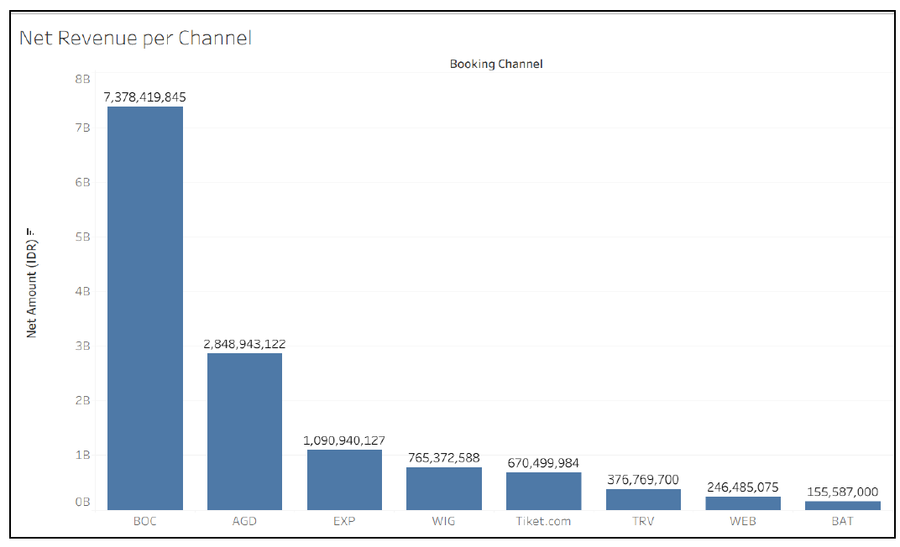
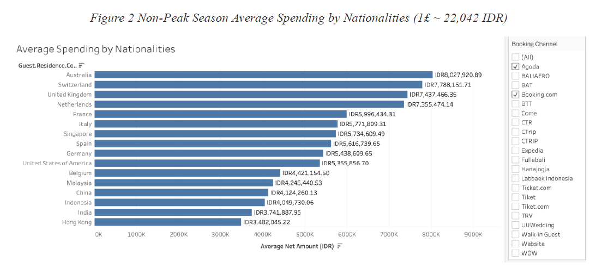

# Hotel Pricing Strategy & Customer Analytics  
*A Data-Driven Pricing and Segmentation Project*

## 📌 Project Overview
This project develops a **data-driven pricing and promotion strategy** for a luxury boutique resort in Bali, Indonesia (Airis Luxury Villa & Spa), using real booking and revenue data.  

The objective is to identify **pricing inefficiencies** and design a **segmented, seasonally adjusted pricing framework** that improves revenue performance while preserving the resort’s premium brand positioning.

The analysis combines **exploratory data analysis, regression modelling, customer segmentation, and scenario analysis** to support actionable pricing decisions.

---

## 🎯 Business Problem
The resort’s pricing decisions relied heavily on OTA (Online Travel Agency) market benchmarks, making the business a *price taker* rather than a *price setter*.  
This creates risks of:
- Underpricing high-value demand  
- Over-discounting price-sensitive segments  
- Low occupancy during off-peak seasons  

**Key question:**  
> How can pricing and promotions be structured using internal data to maximise revenue without diluting brand value?

---

## 📊 Data & Methodology

### Data Sources
- Booking transactions (2024–2025)
- Booking channels (Booking.com, Agoda, Expedia, etc.)
- Guest nationality
- Room type
- Seasonality (month, weekday)
- Repeat guest indicator
- Net nightly room rate (IDR)

Due to confidentiality, raw data is not publicly shared in this repository

---

### Analytical Approach
1. **Exploratory Data Analysis (EDA)**
   - Revenue distribution by booking channel
   - Average spend by nationality (peak vs. low season)
   - Occupancy rate by room type

2. **Regression Analysis**
   - Log-linear regression models to identify key price drivers
   - Controlled for room type, seasonality, booking channel, and nationality
   - Compared price premiums across booking channels

3. **Customer Segmentation**
   - Segmented guests into **high-value, mid-tier, and budget** groups
   - Differentiated by nationality and season

4. **Strategy Design**
   - Targeted low-season (Jan–Mar) promotions
   - Channel-specific pricing rules
   - Room-type-based discount structure

5. **Scenario & Risk Analysis**
   - Demand shock (e.g. travel downturn)
   - Demand boom scenarios
   - Spillover and fairness risks in price discrimination

---

## 🔍 Key Insights

- **Revenue by Channel**:  
  After controlling for other factors, some channels consistently command higher net nightly rates.
  
  *Booking.com & Agoda dominate revenue share — supports focusing pricing strategy here.*

- **Nationality-based price sensitivity exists**:  
  European and Australian travellers show higher average spending, while several Asian markets are more price sensitive.

- **Low season = missed revenue opportunity**:  
  Occupancy drops significantly from January to March, especially for larger room types.

- **Discounting everyone is not optimal**:  
  Targeted promotions for *mid-tier segments* outperform blanket discounts.

---

## 💡 Proposed Strategy

- Focus promotions on **mid-tier international markets** during low season  
- Use **Booking.com and Agoda** for targeted offers due to their revenue dominance  
- Apply **room-type-based discount intensity** based on historical occupancy  
- Protect premium positioning by:
  - Avoiding deep discounts for high-value customers
  - Using value-added benefits instead of price cuts

---

## 🛠 Tools & Technologies
- **R**: regression modelling, statistical analysis  
- **Tableau**: revenue and nationality visualisations  
- **Excel**: data preparation and validation  
- **Asana**: project management  
- **Generative AI (ChatGPT)**: occupancy calculations and scenario ideation (validated by team)

---
